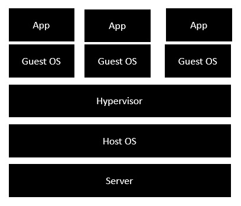

ImageID - Il s'agit de l'ID d'image pour lequel vous souhaitez voir toutes les commandes qui ont été exécutées.

* Le serveur est le serveur physique utilisé pour héberger plusieurs machines virtuelles.
* Le système d'exploitation hôte est la machine de base telle que Linux ou Windows.
* L'hyperviseur est soit VMWare, soit Windows Hyper V, utilisé pour héberger des ordinateurs virtuels.
* Vous installeriez ensuite plusieurs systèmes d'exploitation en tant que machines virtuelles par-dessus l'hyperviseur existant en tant que système d'exploitation invité.
* Vous devriez ensuite héberger vos applications sur chaque système d'exploitation invité.

L'image suivante montre la nouvelle génération de virtualisation activée via les dockers. Regardons les différentes couches.

* Le serveur est le serveur physique utilisé pour héberger plusieurs machines virtuelles. Donc, cette couche reste la même.
* Le système d'exploitation hôte est la machine de base telle que Linux ou Windows. Donc, cette couche reste la même.
* Maintenant vient la nouvelle génération qui est le moteur Docker. Ceci est utilisé pour exécuter le système d'exploitation qui était auparavant des machines virtuelles en tant que conteneurs Docker.
* Toutes les applications sont maintenant exécutées en tant que conteneurs Docker.

L’avantage évident de cette architecture est que vous n’avez pas besoin de matériel supplémentaire pour le système d’exploitation invité. Tout fonctionne comme des conteneurs Docker.