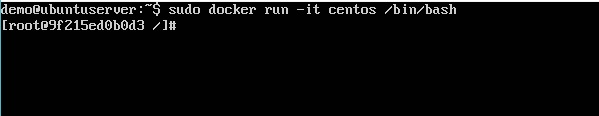
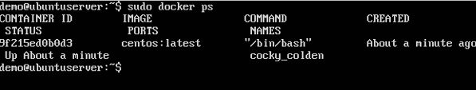
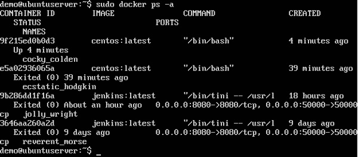

Les conteneurs sont des instances d'images Docker pouvant être exécutées à l'aide de la commande d'exécution Docker. L'objectif principal de Docker est d'exécuter des conteneurs. Voyons comment travailler avec des conteneurs.

## Running a Container

L'exécution des conteneurs est gérée à l'aide de la commande d'exécution Docker. Pour exécuter un conteneur en mode interactif, lancez d'abord le conteneur Docker.

sudo docker run –it centos /bin/bash 

Vous exécuterez ensuite l'instance du système CentOS sur le serveur Ubuntu.
## Listing of Containers
Vous pouvez répertorier tous les conteneurs de la machine via la commande docker ps. Cette commande est utilisée pour renvoyer les conteneurs en cours d'exécution.

docker ps

## Syntax

docker ps 

## Les options
Aucun

## Valeur de retour
La sortie affichera les conteneurs en cours d'exécution.

## Exemple
sudo docker ps

## Output

docker ps -a

Syntax
docker ps -a 

sudo docker ps -a 

## Output

docker history ImageID 

Options

* ImageID - Il s'agit de l'ID d'image pour lequel vous souhaitez voir toutes les commandes qui ont été exécutées.

