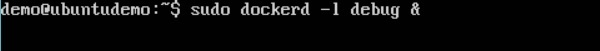

Docker dispose de mécanismes de journalisation qui peuvent être utilisés pour résoudre les problèmes au fur et à mesure qu'ils surviennent. Il existe une journalisation au niveau du démon et du conteneur. Examinons les différents niveaux de journalisation.
## Daemon Logging

Au niveau de "Daemon Logging", il existe quatre niveaux de journalisation disponibles:
* Debug - Il détaille toutes les informations possibles traitées par le processus démon.

* Info - Il détaille toutes les erreurs et les informations gérées par le processus démon.

* Erreurs - Il détaille toutes les erreurs gérées par le processus démon.

* Fatal - Il ne détaille que toutes les erreurs fatales gérées par le processus démon.

Suivez les étapes suivantes pour savoir comment activer la journalisation.

Étape 1 - Nous devons d’abord arrêter le processus du démon docker, s’il est déjà en cours d’exécution. Cela peut être fait en utilisant la commande suivante -

sudo service docker stop 

Étape 2 - Nous devons maintenant démarrer le processus du démon docker. Mais cette fois, nous devons ajouter le paramètre –l pour spécifier l’option de journalisation. Lançons donc la commande suivante lors du démarrage du processus du démon docker.

sudo dockerd –l debug &

Les points suivants doivent être notés à propos de la commande ci-dessus -

* dockerd est l'exécutable du processus du démon docker.

* L'option –l permet de spécifier le niveau de journalisation. Dans notre cas, nous mettons cela comme debug

* & est utilisé pour revenir à l'invite de commande après l'activation de la journalisation.

Une fois que vous avez démarré le processus Docker avec la journalisation, vous verrez maintenant les journaux de débogage envoyés à la console.

Désormais, si vous exécutez une commande Docker telle que des images de menu fixe, les informations de débogage seront également envoyées à la console.

