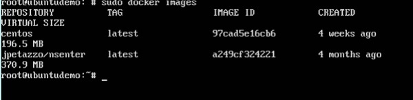
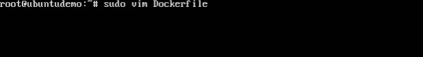
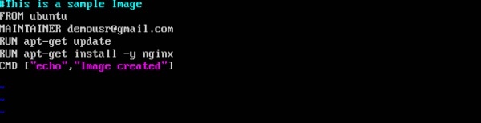

Dans les chapitres précédents, nous avons vu divers fichiers d’image, tels que Centos, téléchargés à partir du hub Docker à partir duquel vous pouvez créer des conteneurs. Un exemple est à nouveau présenté ci-dessous.
 
Si nous utilisons la commande Docker images, nous pouvons voir les images existantes dans notre système. La capture d'écran ci-dessus montre qu'il existe deux images: centos et nsenter.

Mais Docker vous donne également la possibilité de créer vos propres images Docker, et cela peut être fait à l'aide de fichiers Docker. Un fichier Docker est un simple fichier texte contenant des instructions sur la création de vos images.

Les étapes suivantes expliquent comment créer un fichier Docker.

Étape 1 - Créez un fichier appelé fichier Docker et modifiez-le à l'aide de vim. Veuillez noter que le nom du fichier doit être "Dockerfile" avec "D" en majuscule.

Étape 2 - Construisez votre fichier Docker en utilisant les instructions suivantes.

#This is a sample Image 
FROM ubuntu 
MAINTAINER demousr@gmail.com 

RUN apt-get update 
RUN apt-get install –y nginx 
CMD [“echo”,”Image created”] 

## Les points suivants doivent être notés à propos du fichier ci-dessus -

* La première ligne "#Il s'agit d'un exemple d'image" est un commentaire. Vous pouvez ajouter des commentaires au fichier Docker à l'aide de la commande #
* La ligne suivante doit commencer par le mot clé FROM. Il indique à docker, à partir de quelle image de base vous souhaitez baser votre image. Dans notre exemple, nous créons une image à partir de l'image d'ubuntu.
* La commande suivante est la personne qui va conserver cette image. Ici, vous spécifiez le mot clé MAINTAINER et ne mentionnez que l'ID de messagerie.
* La commande RUN est utilisée pour exécuter des instructions sur l'image. Dans notre cas, nous mettons d'abord à jour notre système Ubuntu, puis nous installons le serveur nginx sur notre image Ubuntu.
* La dernière commande est utilisée pour afficher un message à l'utilisateur.
## Étape 3 - Enregistrez le fichier. Dans le prochain chapitre, nous verrons comment construire l’image.
