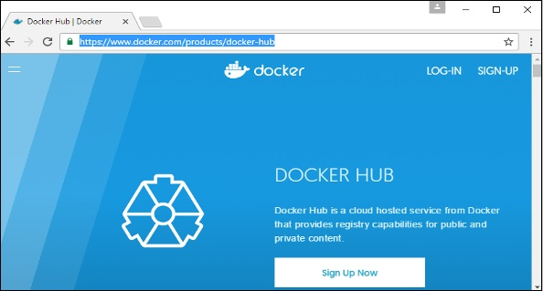
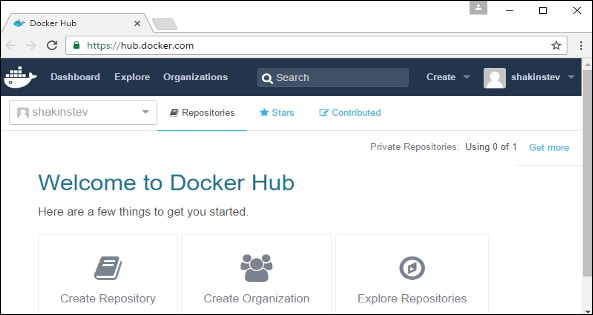
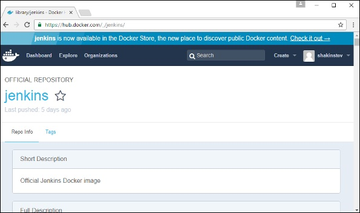
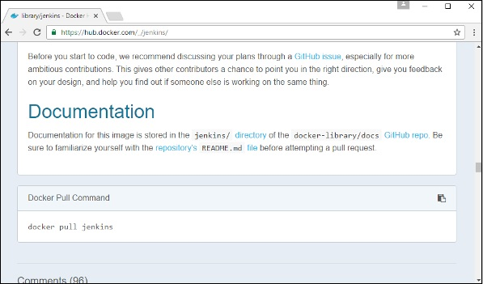
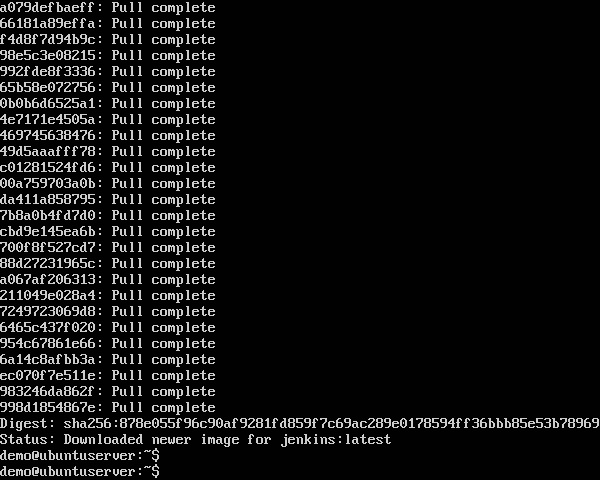
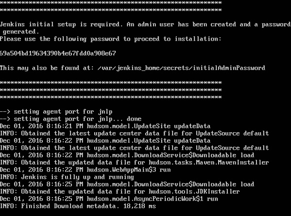

Docker Hub est un service de registre sur le cloud qui vous permet de télécharger des images Docker construites par d'autres communautés. Vous pouvez également télécharger vos propres images construites par Docker sur le hub Docker. Dans ce chapitre, nous verrons comment télécharger et utiliser l’image Jenkins Docker à partir du hub Docker.

Le site officiel de Docker Hub est - https://www.docker.com/community-edition#/add_ons

# Étape 1 - Vous devez d’abord effectuer une inscription simple sur le hub Docker.

# Étape 2 - Une fois que vous vous êtes inscrit, vous serez connecté à Docker Hub.

# Étape 3 - Ensuite, parcourons et trouvons l’image Jenkins.

# Étape 4 - Si vous faites défiler la même page vers le bas, vous pouvez voir la commande Docker pull. Ceci sera utilisé pour télécharger l'image Jenkins sur le serveur Ubuntu local.

# Étape 5 - Maintenant, allez sur le serveur Ubuntu et exécutez la commande suivante -

### sudo docker pull jenkins 

Pour exécuter Jenkins, vous devez exécuter la commande suivante -

### sudo docker run -p 8080:8080 -p 50000:50000 jenkins 

Notez les points suivants concernant la commande sudo ci-dessus -

* Nous utilisons la commande sudo pour nous assurer qu’elle fonctionne avec un accès root.

* Jenkins est le nom de l’image que nous souhaitons télécharger à partir du hub Docker et installer sur notre machine Ubuntu.

* -p est utilisé pour mapper le numéro de port de l'image Docker interne sur notre serveur Ubuntu principal afin que nous puissions accéder au conteneur en conséquence.

