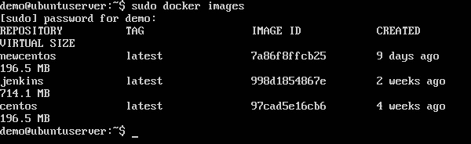
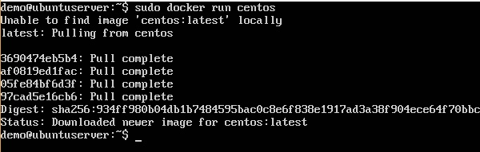
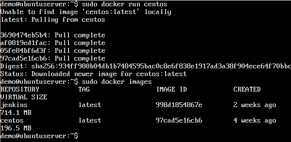
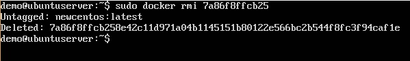
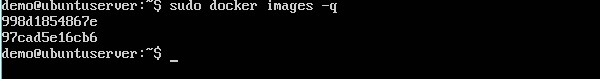
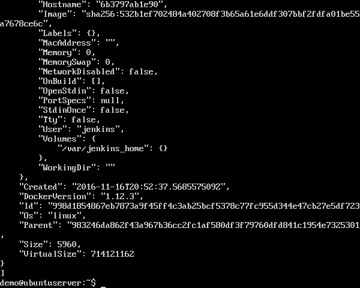

Dans Docker, tout est basé sur Images. Une image est une combinaison d'un système de fichiers et de paramètres. Prenons un exemple de la commande suivante dans Docker.

### docker run hello-world 

* La commande Docker est spécifique et indique au programme Docker du système d’exploitation qu’il faut faire quelque chose.
* La commande run est utilisée pour indiquer que nous voulons créer une instance d'une image, qui s'appelle alors un conteneur.
* Enfin, "hello-world" représente l'image à partir de laquelle le conteneur est fabriqué. 

Voyons maintenant comment utiliser l’image CentOS disponible dans Docker Hub pour exécuter CentOS sur notre machine Ubuntu. Nous pouvons le faire en exécutant la commande suivante sur notre machine Ubuntu -

### sudo docker run centos –it /bin/bash

Notez les points suivants concernant la commande sudo ci-dessus -

* Nous utilisons la commande sudo pour nous assurer qu’elle fonctionne avec un accès root.

* Centos est le nom de l'image que nous voulons télécharger depuis Docker Hub et installer sur notre machine Ubuntu.

* Il est utilisé pour mentionner que nous voulons fonctionner en mode interactif.

* / bin / bash est utilisé pour exécuter le shell bash une fois que CentOS est opérationnel.

## Displaying Docker Images

Pour voir la liste des images Docker sur le système, vous pouvez exécuter la commande suivante.

### docker images

Cette commande permet d’afficher toutes les images actuellement installées sur le système.

### Syntax

### docker images 

### Options

None

##Return Value

La sortie fournira la liste des images sur le système.

### Example

sudo docker images

## Output

Lorsque nous exécutons la commande ci-dessus, le résultat suivant sera obtenu:

Dans la sortie ci-dessus, vous pouvez voir que le serveur a trois images: centos, newcentos et jenkins. Chaque image a les attributs suivants -

* TAG - Ceci est utilisé pour marquer logiquement les images.

* Image ID - Ceci est utilisé pour identifier l'image de manière unique.

* Créé: nombre de jours depuis la création de l'image.

* Taille virtuelle - La taille de l'image.

## Téléchargement d'images Docker

Les images peuvent être téléchargées à partir de Docker Hub à l'aide de la commande d'exécution de Docker. Voyons en détail comment nous pouvons faire cela.

##Syntaxe

La syntaxe suivante est utilisée pour exécuter une commande dans un conteneur Docker.

### docker run image 

## Options

* Image − This is the name of the image which is used to run the container.

## Return Value
La sortie exécutera la commande dans le conteneur souhaité.

## Example

sudo docker run centos

Cette commande téléchargera l’image centos, si elle n’est pas déjà présente, et exécutera le système d’exploitation en tant que conteneur.

## Output

Lorsque nous exécutons la commande ci-dessus, nous obtiendrons le résultat suivant:

You will now see the CentOS Docker image downloaded. Now, if we run the Docker images command to see the list of images on the system, we should be able to see the centos image as well.

## Removing Docker Images

Les images Docker du système peuvent être supprimées via la commande docker rmi. Voyons cette commande plus en détail.

docker rmi

Cette commande est utilisée pour supprimer les images Docker.

## Syntax

docker rmi ImageID

## Options

* ImageID - Ceci est l'ID de l'image à supprimer.

## Return Value

La sortie fournira l'ID d'image de l'image supprimée.

sudo docker rmi 7a86f8ffcb25 

## Output

Voyons d’autres commandes Docker sur les images.

docker images -q

## Syntax

docker images 

* q − It tells the Docker command to return the Image ID’s only.

## Valeur de retour

La sortie ne montrera que l’ID d’image des images sur l’hôte Docker.

## Exemple

sudo docker images -q 

## docker inspect

Cette commande est utilisée pour voir les détails d'une image ou d'un conteneur.

docker inspect Repository 

sudo docker inspect jenkins 

