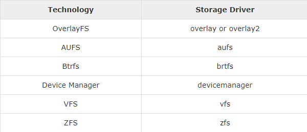
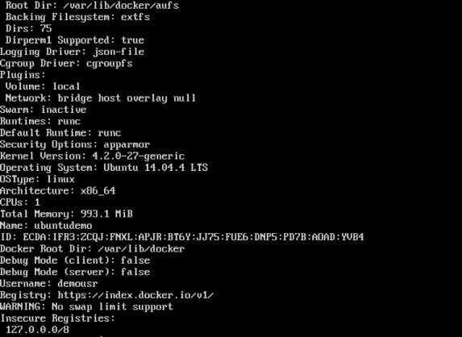
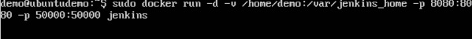
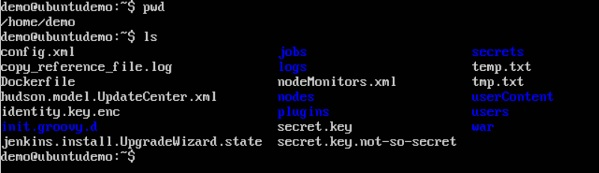

#Pilotes de stockage

Docker dispose de plusieurs pilotes de stockage permettant de travailler avec les périphériques de stockage sous-jacents. Le tableau suivant répertorie les différents pilotes de stockage ainsi que la technologie utilisée pour les pilotes de stockage.


Parlons maintenant des cas dans lesquels vous utiliseriez les différents pilotes de stockage -

## AUFS

* C'est un pilote stable. peut être utilisé pour des applications prêtes à la production.

* Il a une bonne utilisation de la mémoire et permet de garantir une expérience fluide de Docker pour les conteneurs.

* Une activité d'écriture élevée associée à ce pilote doit être prise en compte.

* C’est bon pour les systèmes qui fonctionnent comme une plate-forme.

## Devicemapper

* C'est un pilote stable. assure une expérience en douceur Docker.

* Ce pilote est utile pour tester des applications en laboratoire.

* Ce pilote correspond aux principales fonctionnalités du noyau Linux.

## Btrfs

* Ce pilote correspond aux principales fonctionnalités du noyau Linux.

* Une activité d'écriture élevée associée à ce pilote doit être prise en compte.

* Ce pilote convient aux instances dans lesquelles vous gérez plusieurs pools de construction.

## Ovelay

* Ce pilote est stable et conforme aux principales fonctionnalités du noyau Linux.

* Il a une bonne utilisation de la mémoire.

* Ce pilote est utile pour tester des applications en laboratoire.

## ZFS

* C'est un pilote stable et il est bon pour tester des applications en laboratoire.

* C’est bon pour les systèmes fonctionnant comme une plate-forme en tant que service.

Pour voir le pilote de stockage utilisé, lancez la commande docker info.

##Syntaxe

``` docker info 

## Les options
None

## Valeur de retour

La commande fournira toutes les informations relatives au composant Docker installé sur l'hôte Docker.
## Exemple

``` sudo docker info 

## Output



Volumes de données

Dans Docker, vous disposez d'un volume séparé pouvant être partagé entre plusieurs conteneurs. Celles-ci sont appelées volumes de données. Certaines des caractéristiques du volume de données sont -

* Ils sont initialisés lors de la création du conteneur.
* Ils peuvent être partagés et réutilisés entre plusieurs conteneurs.
* Toute modification du volume lui-même peut être effectuée directement.
* Ils existent même après la suppression du conteneur.

Regardons notre conteneur Jenkins. Faisons un docker inspecter pour voir les détails de cette image. Nous pouvons émettre la commande suivante pour écrire le résultat de la commande docker inspect dans un fichier texte, puis afficher le fichier en conséquence.

``` sudo docker inspect Jenkins > tmp.txt

Lorsque vous affichez le fichier texte à l'aide de la commande more, vous verrez une entrée sous la forme JENKINS_HOME = / var / Jenkins_home.

Il s'agit du mappage effectué dans le conteneur via l'image Jenkins.


Supposons maintenant que vous vouliez mapper le volume du conteneur sur un volume local, puis vous devez spécifier l'option –v lors du lancement du conteneur. Un exemple est montré ci-dessous -

``` sudo docker run –d –v /home/demo:/var/jenkins_home –p 8080:8080 –p 50000:50000 jenkins 

L'option –v est utilisée pour mapper le volume dans le conteneur / var / jenkins_home vers un emplacement de notre hôte Docker qui est / home / demo.


Maintenant, si vous allez à l'emplacement / home / demo sur votre hôte Docker après avoir lancé votre conteneur, vous verrez tous les fichiers de conteneur présents à cet emplacement.


