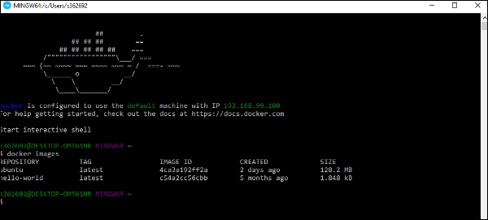
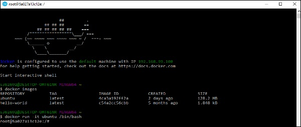
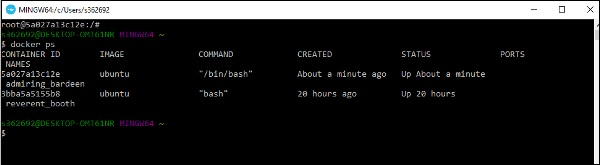

La bonne chose à propos du moteur Docker est qu’il est conçu pour fonctionner sur différents systèmes d’exploitation. Nous avons déjà vu l'installation sur Windows et toutes les commandes Docker sur les systèmes Linux. Voyons maintenant les différentes commandes Docker sur le système d’exploitation Windows.

## Docker Images
Lançons la commande images Docker sur l’hôte Windows.

À partir de là, nous pouvons voir que nous avons deux images - Ubuntu et hello-world.
## Running a Container
Exécutons maintenant un conteneur dans l’hôte Windows Docker.

Nous pouvons voir qu'en exécutant le conteneur, nous pouvons maintenant exécuter le conteneur Ubuntu sur un hôte Windows.
## Listing All Containers

Listons tous les conteneurs sur l’hôte Windows.\

## Stopping a Container

Arrêtons maintenant un conteneur en cours d’exécution sur l’hôte Windows.

Vous pouvez donc constater que le moteur Docker est relativement cohérent s’agissant de différents hôtes Docker et qu’il fonctionne sous Windows de la même manière que sous Linux.
