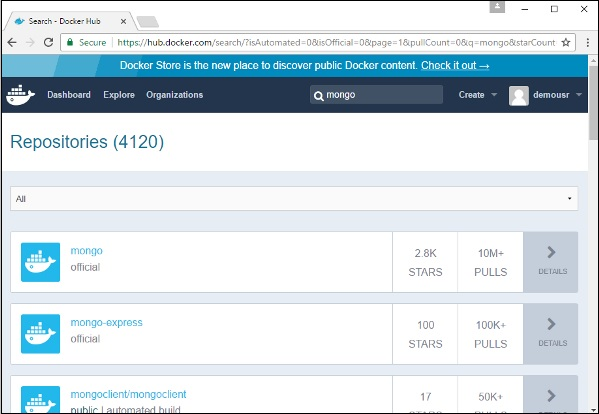
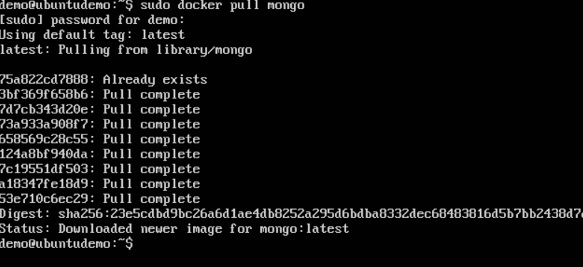
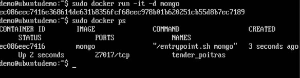
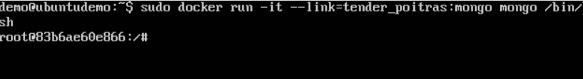
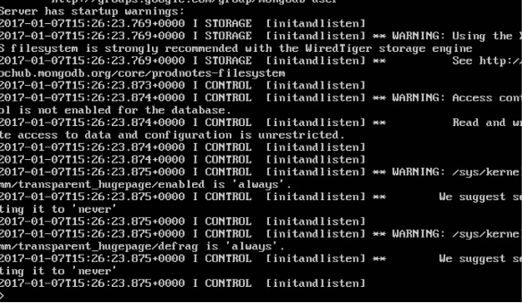
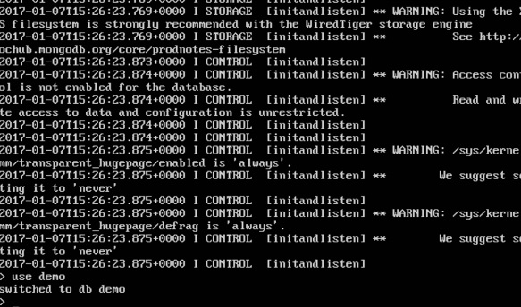

MongoDB est une célèbre base de données orientée document utilisée par de nombreuses applications Web modernes. Puisque MongoDB est une base de données populaire pour le développement, Docker s’est également assuré qu’il prenait en charge MongoDB.

Nous allons maintenant voir les différentes étapes pour obtenir le conteneur Docker pour MongoDB opérationnel.

Étape 1 - La première étape consiste à extraire l’image de Docker Hub. Lorsque vous vous connecterez à Docker Hub, vous pourrez rechercher et voir l'image de Mongo comme indiqué ci-dessous. Il suffit de taper Mongo dans le champ de recherche et de cliquer sur le lien Mongo (officiel) qui apparaît dans les résultats de la recherche.

Étape 2 - Vous verrez que la commande d'extraction Docker pour Mongo figure dans les détails du référentiel de Docker Hub.

Étape 3 - Sur l’hôte Docker, utilisez la commande Docker comme indiqué ci-dessus pour télécharger la dernière image Mongo à partir de Docker Hub.

Étape 4 - Maintenant que nous avons l'image pour Mongo, commençons par exécuter un conteneur MongoDB qui sera notre instance pour MongoDB. Pour cela, nous allons émettre la commande suivante -

sudo docker run -it -d mongo

Les points suivants peuvent être notés à propos de la commande ci-dessus -

* L'option –it est utilisée pour exécuter le conteneur en mode interactif.

* L'option –d permet d'exécuter le conteneur en tant que processus démon.

* Et enfin, nous créons un conteneur à partir de l'image Mongo.

Vous pouvez ensuite émettre la commande docker ps pour voir les conteneurs en cours d'exécution -

Prenez note des points suivants -

* Le nom du conteneur est tender_poitras. Ce nom sera différent puisque le nom des conteneurs ne cesse de changer lorsque vous faites tourner un conteneur. Mais notez simplement le conteneur que vous avez lancé.

* Ensuite, notez également le numéro de port sur lequel il est exécuté. Il écoute sur le port TCP de 27017.

Étape 5 - Lançons maintenant un autre conteneur qui servira de client et qui servira à se connecter à la base de données MongoDB. Lançons la commande suivante pour cela -

sudo docker run –it –link=tender_poitras:mongo mongo /bin/bash 

Les points suivants peuvent être notés à propos de la commande ci-dessus -

* L'option –it est utilisée pour exécuter le conteneur en mode interactif.

* Nous lions maintenant notre nouveau conteneur au conteneur de serveur MongoDB déjà lancé. Ici, vous devez mentionner le nom du conteneur déjà lancé.

* Nous spécifions ensuite que nous voulons lancer le conteneur Mongo en tant que client, puis exécuter le shell bin / bash dans notre nouveau conteneur.

Vous allez maintenant être dans le nouveau conteneur.

Étape 6 - Exécutez la commande env dans le nouveau conteneur pour voir les détails de la connexion au conteneur du serveur MongoDB.

Étape 6 - Il est maintenant temps de vous connecter au serveur MongoDB à partir du conteneur client. Nous pouvons le faire via la commande suivante -

mongo 172.17.0.2:27017 

Les points suivants doivent être notés à propos de la commande ci-dessus

* La commande mongo est la commande client mongo utilisée pour se connecter à une base de données MongoDB.

* L'adresse IP et le numéro de port correspondent à ce que vous obtenez lorsque vous utilisez la commande env.

Une fois que vous avez exécuté la commande, vous serez alors connecté à la base de données MongoDB.

Vous pouvez ensuite exécuter n'importe quelle commande MongoDB à l'invite de commande. Dans notre exemple, nous exécutons la commande suivante -

''' use demo

Cette commande est une commande MongoDB utilisée pour passer à une démo de nom de base de données. Si la base de données n'est pas disponible, elle sera créée.

Vous venez maintenant de créer un conteneur MongoDB client et serveur.
