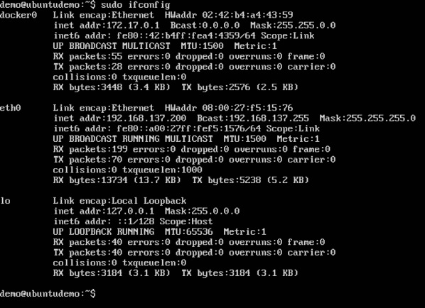
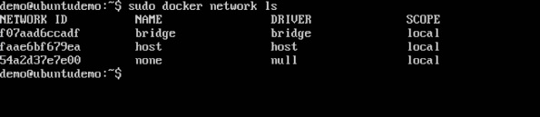
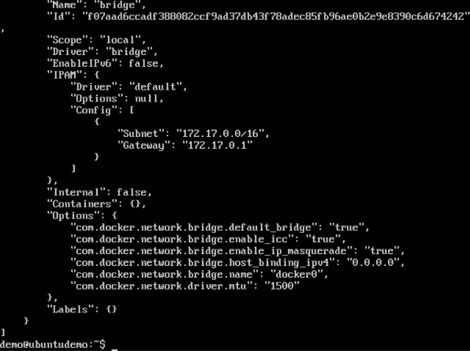
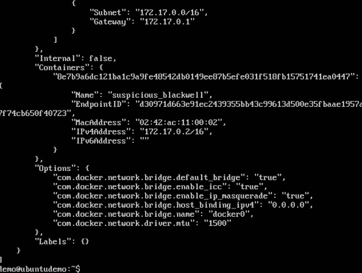
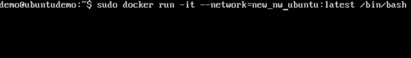
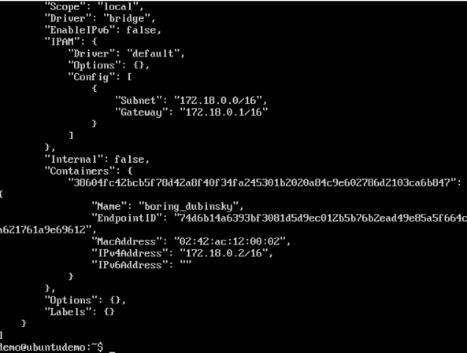

Docker prend en charge les aspects de mise en réseau afin que les conteneurs puissent communiquer avec d'autres conteneurs ainsi qu'avec l'hôte Docker. Si vous effectuez un ifconfig sur l'hôte Docker, vous verrez l'adaptateur Ethernet Docker. Cet adaptateur est créé lorsque Docker est installé sur l'hôte Docker.

C'est un pont entre l'hôte Docker et l'hôte Linux. Voyons maintenant quelques commandes associées à la mise en réseau dans Docker.

##Liste de tous les réseaux Docker

Cette commande peut être utilisée pour répertorier tous les réseaux associés à Docker sur l'hôte.

##Syntaxe

docker network ls 

##Options	

None

##Valeur de retour

La commande affichera tous les réseaux sur l'hôte Docker.

##Exemple

sudo docker network ls

sortie

#Inspection d'un réseau Docker

sudo docker network inspect bridge 

Exécutons maintenant un conteneur et voyons ce qui se passe lorsque nous inspectons à nouveau le réseau. Faisons tourner un conteneur Ubuntu avec la commande suivante -

sudo docker run –it ubuntu:latest /bin/bash 

Maintenant, si nous inspectons notre nom de réseau via la commande suivante, vous verrez maintenant que le conteneur est attaché au pont.

 sudo docker network inspect bridge

#Créer votre propre nouveau réseau

docker network create –-driver drivername name 

* drivername - C'est le nom utilisé pour le pilote de réseau.

* name - C'est le nom donné au réseau.

sudo docker network create –-driver bridge new_nw 

sudo docker network inspect new_nw 

