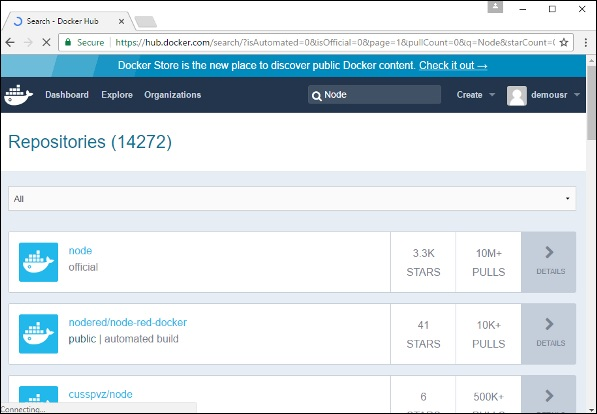
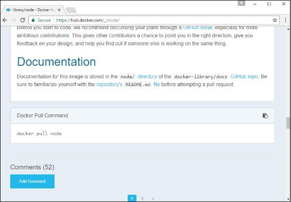
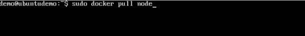
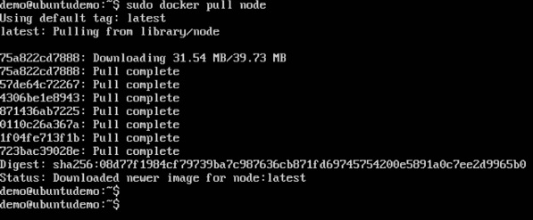

Node.js est un framework JavaScript utilisé pour développer des applications côté serveur. Il s’agit d’un framework open source développé pour fonctionner sur divers systèmes d’exploitation. Étant donné que Node.js est un framework de développement populaire, Docker s’est également assuré qu’il prenait en charge les applications Node.js.

Nous allons maintenant voir les différentes étapes pour obtenir le conteneur Docker pour Node.js opérationnel.

Étape 1 - La première étape consiste à extraire l’image de Docker Hub. Lorsque vous vous connecterez à Docker Hub, vous pourrez rechercher et voir l’image de Node.js comme indiqué ci-dessous. Il suffit de taper Node dans le champ de recherche et de cliquer sur le lien (officiel) du nœud qui apparaît dans les résultats de la recherche.



Étape 2 - Vous verrez que la commande d'extraction Docker pour le nœud figure dans les détails du référentiel dans Docker Hub.


Étape 3 - Sur l’hôte Docker, utilisez la commande Docker comme indiqué ci-dessus pour télécharger la dernière image de noeud à partir de Docker Hub.



Une fois le tirage terminé, nous pouvons alors passer à l’étape suivante.



Étape 4 - Sur l’hôte Docker, utilisons l’éditeur vim et créons un exemple de fichier Node.js. Dans ce fichier, nous allons ajouter une commande simple pour afficher «HelloWorld» à l'invite de commande.


Dans le fichier Node.js, ajoutons l’instruction suivante:

``` Console.log(‘Hello World’);

Cela produira la phrase «Hello World» lorsque nous l'exécuterons via Node.js.

Étape 5 - Pour exécuter notre script Node.js à l'aide du conteneur Node Docker, nous devons exécuter l'instruction suivante:

```sudo docker run –it –rm –name = HelloWorld –v “$PWD”:/usr/src/app 
```–w /usr/src/app node node HelloWorld.js


Les points suivants doivent être notés à propos de la commande ci-dessus -

* L'option –rm est utilisée pour supprimer le conteneur après son exécution.

* Nous donnons un nom au conteneur appelé «HelloWorld».

* Nous parlons de mapper le volume dans le conteneur qui est / usr / src / app à notre répertoire de travail actuel. Ceci est fait pour que le conteneur de noeud récupère notre script HelloWorld.js qui est présent dans notre répertoire de travail sur l'hôte Docker.

* L'option –w est utilisée pour spécifier le répertoire de travail utilisé par Node.js.

* La première option de nœud est utilisée pour spécifier l'exécution de l'image du nœud.

* La deuxième option de nœud est utilisée pour mentionner l'exécution de la commande de nœud dans le conteneur de nœuds.

* Et enfin, nous mentionnons le nom de notre script.

Nous aurons ensuite la sortie suivante. Et à la sortie, nous pouvons clairement voir que le conteneur Node s’exécutait en tant que conteneur et exécutait le script HelloWorld.js.
