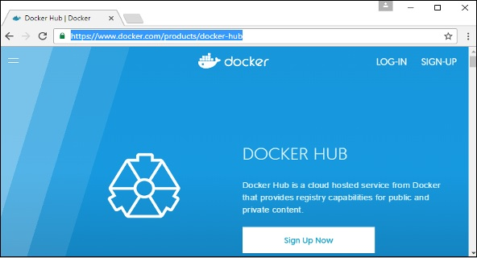
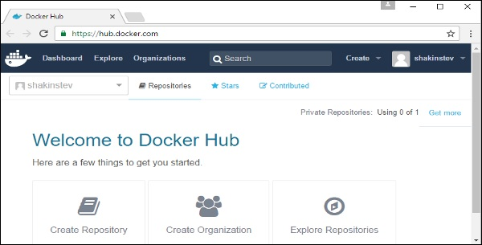
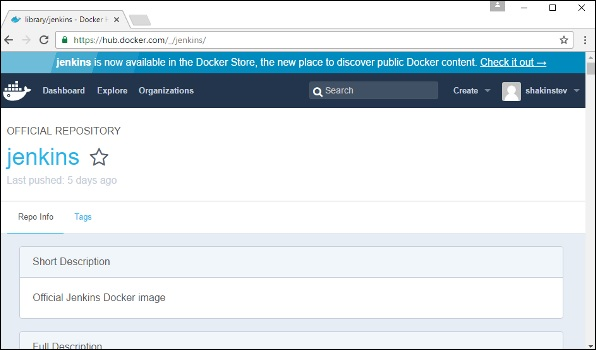
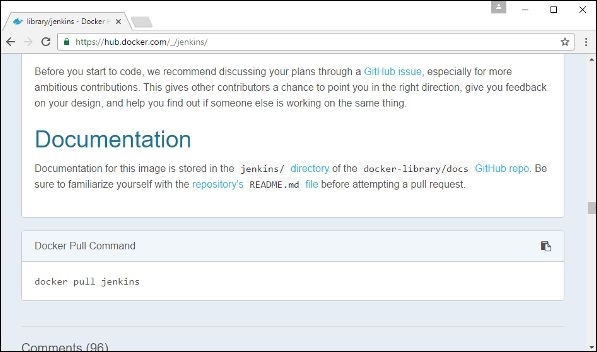
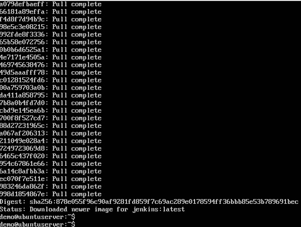
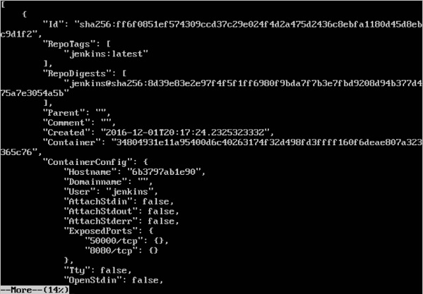
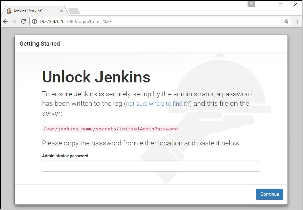

Dans Docker, les conteneurs eux-mêmes peuvent avoir des applications s'exécutant sur des ports. Lorsque vous exécutez un conteneur, si vous souhaitez accéder à l'application qu'il contient via un numéro de port, vous devez mapper le numéro de port du conteneur sur le numéro de port de l'hôte Docker. Voyons un exemple de la façon dont cela peut être réalisé.

Dans notre exemple, nous allons télécharger le conteneur Jenkins à partir de Docker Hub. Nous allons ensuite mapper le numéro de port Jenkins au numéro de port sur l'hôte Docker.

Étape 1 - Vous devez d’abord effectuer une inscription simple sur Docker Hub.

 

Étape 2 - Une fois que vous vous êtes inscrit, vous serez connecté à Docker Hub.

 

Étape 3 - Ensuite, parcourons et trouvons l’image Jenkins.

 

Étape 4 - Si vous faites défiler la même page vers le bas, vous pouvez voir la commande Docker pull. Ceci sera utilisé pour télécharger l'image Jenkins sur le serveur Ubuntu local.

 

Étape 5 - Allez maintenant sur le serveur Ubuntu et lancez la commande -
## sudo docker pull jenkins 

 

Étape 6 - Pour comprendre quels ports sont exposés par le conteneur, vous devez utiliser la commande inspecter Docker pour inspecter l'image.

En savoir plus sur cette commande inspect.

## docker inspecter
Cette méthode permet de renvoyer des informations de bas niveau sur le conteneur ou l'image.

## Syntaxe

docker inspecter conteneur / image

## Exemple:

sudo docker inspect jenkins 

 

La sortie de la commande inspecte donne une sortie JSON. Si nous observons la sortie, nous pouvons voir qu’il existe une section de "ExposedPorts" et voir que deux ports sont mentionnés. L'un est le port de données de 8080 et l'autre est le port de contrôle de 50000.

Pour exécuter Jenkins et mapper les ports, vous devez modifier la commande d'exécution de Docker et ajouter l'option ‘p’ qui spécifie le mappage de port. Donc, vous devez exécuter la commande suivante -

sudo docker run -p 8080:8080 -p 50000:50000 jenkins 

Le côté gauche du mappage de numéro de port est le port de l'hôte Docker vers lequel mapper et le côté droit est le numéro de port du conteneur Docker.

Lorsque vous ouvrez le navigateur et accédez à l'hôte Docker sur le port 8080, Jenkins est opérationnel.

 

