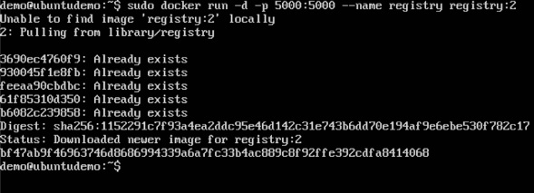
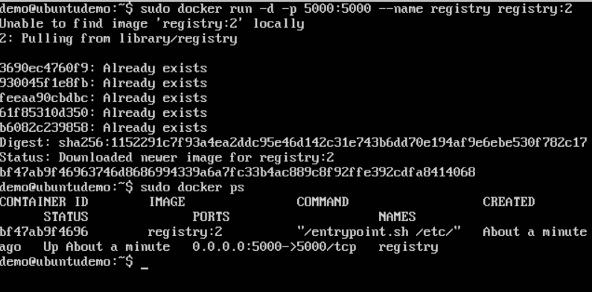
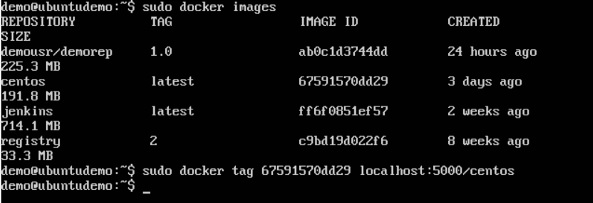
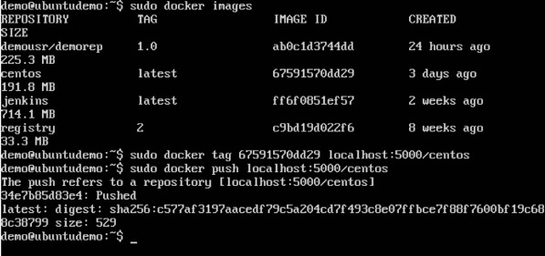
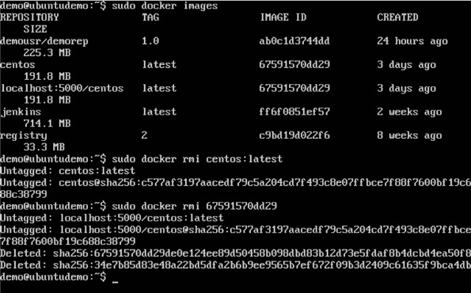

Etape 1:

Utilisez la commande d'exécution Docker pour télécharger le registre privé. Cela peut être fait en utilisant la commande suivante.
sudo docker run –d –p 5000:5000 –-name registry registry:2
Les points suivants doivent être notés à propos de la commande ci-dessus -

* Registry est le conteneur géré par Docker qui peut être utilisé pour héberger des référentiels privés.

* Le numéro de port exposé par le conteneur est 5000. Par conséquent, avec la commande –p, nous mappons le même numéro de port sur le numéro de port 5000 sur notre hôte local.

* Nous ne faisons que marquer le conteneur de registre comme «2» pour le différencier sur l'hôte Docker.

* L'option –d permet d'exécuter le conteneur en mode détaché. C’est pour que le conteneur puisse s’exécuter en arrière-plan

Étape 2 - Faisons un docker ps pour voir que le conteneur de registre est en cours d’exécution.

Nous avons maintenant confirmé que le conteneur de registre est effectivement en cours d'exécution.

Étape 3 - Lançons l’étiquetage de l’une de nos images existantes afin de pouvoir la transférer dans notre référentiel local. Dans notre exemple, comme l’image centos est disponible localement, nous allons l’ajouter à notre référentiel privé et ajouter un nom d’étiquette centos.

sudo docker tag 67591570dd29 localhost:5000/centos 

Les points suivants doivent être notés à propos de la commande ci-dessus -

* 67591570dd29 fait référence à l'ID d'image pour l'image centos.

* localhost: 5000 est l'emplacement de notre référentiel privé.

* Nous étiquetons le nom du référentiel en tant que centos dans notre référentiel privé.

Étape 4 - Utilisons maintenant la commande push de Docker pour transférer le référentiel vers notre référentiel privé.

sudo docker push localhost: 5000 / centos

Ici, nous transférons l’image centos vers le référentiel privé hébergé sur localhost: 5000.

Étape 5 - Supprimons maintenant les images locales que nous avons pour centos à l’aide des commandes docker rmi. Nous pouvons ensuite télécharger l'image centos requise depuis notre référentiel privé.

sudo docker rmi centos:latest 

sudo docker rmi 67591570dd29

Étape 6 - Maintenant que nous n’avons aucune image centos sur notre ordinateur local, nous pouvons maintenant utiliser la commande suivante Docker pull pour extraire l’image centos de notre référentiel privé.

sudo docker pull localhost: 5000 / centos

Ici, nous extrayons l’image centos dans le référentiel privé hébergé sur localhost: 5000.

Si vous voyez maintenant les images sur votre système, vous verrez également l'image centos.