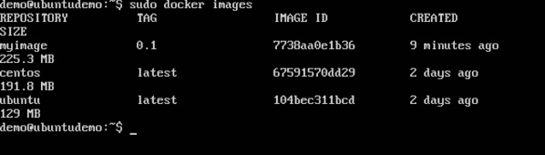
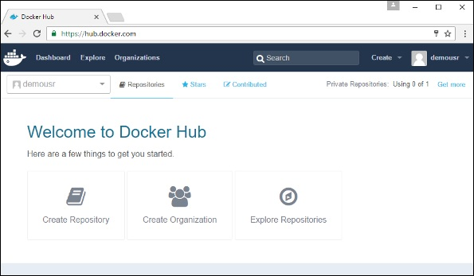
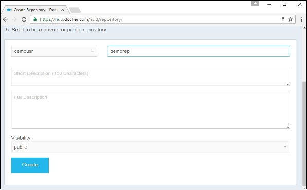
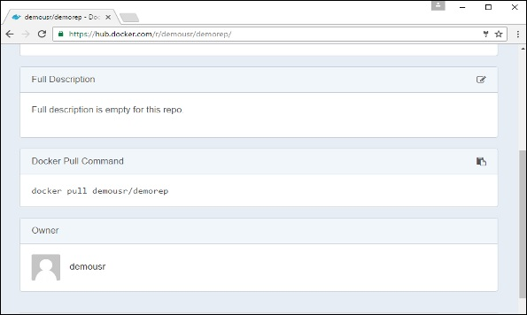
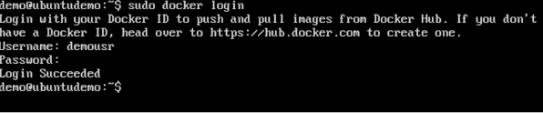
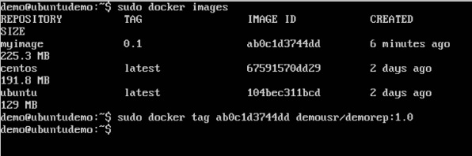
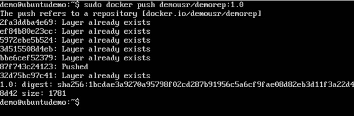
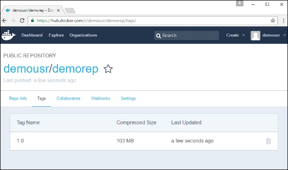
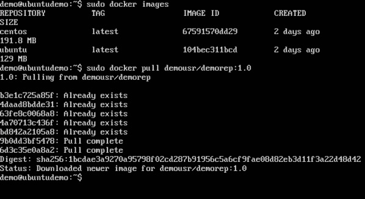

Les référentiels publics peuvent être utilisés pour héberger des images Docker pouvant être utilisées par tout le monde. Les images disponibles dans Docker Hub en sont un exemple. La plupart des images telles que Centos, Ubuntu et Jenkins sont toutes accessibles au public. Nous pouvons également rendre nos images disponibles en les publiant dans le référentiel public de Docker Hub.

Pour notre exemple, nous allons utiliser le référentiel myimage construit dans le chapitre "Construction de fichiers Docker" et télécharger cette image sur Docker Hub. Commençons par examiner les images de notre hôte Docker pour voir ce que nous pouvons transmettre au registre Docker.

Ici, nous avons notre image myimage: 0.1 qui a été créée dans le cadre du chapitre «Créer des fichiers Docker». Utilisons ceci pour charger dans le référentiel public de Docker.

Les étapes suivantes expliquent comment télécharger une image dans un référentiel public.

Étape 1 - Connectez-vous à Docker Hub et créez votre référentiel. C'est le référentiel où votre image sera stockée. Accédez à https://hub.docker.com/ et connectez-vous avec vos informations d'identification.

Étape 2 - Cliquez sur le bouton "Créer un référentiel" sur l'écran ci-dessus et créez un référentiel avec le nom demorep. Assurez-vous que la visibilité du référentiel est publique.

Une fois le référentiel créé, notez la commande pull attachée au référentiel.

La commande pull qui sera utilisée dans notre référentiel est la suivante:

docker pull demousr / demorep
## Étape 3 - Revenez maintenant à l'hôte Docker. Ici, nous devons associer notre image au nouveau référentiel créé dans Docker Hub. Nous pouvons le faire via la commande Docker tag.

Nous en apprendrons plus sur cette commande de balise plus tard dans ce chapitre.

## Étape 4 - Lancez la commande de connexion Docker pour vous connecter au référentiel Docker Hub à partir de l'invite de commande. La commande de connexion de Docker vous invite à entrer le nom d'utilisateur et le mot de passe dans le référentiel de Docker Hub.

## Étape 5 - Une fois l’image étiquetée, il est maintenant temps de l’afficher dans le référentiel Docker Hub. Nous pouvons le faire via la commande push de Docker. Nous en apprendrons plus sur cette commande plus tard dans ce chapitre.

étiquette de docker
Cette méthode permet de marquer une image dans le référentiel approprié.

## Syntaxe
docker tag imageID nom du référentiel
Les options
* imageID - Ceci est l'imageID qui doit être étiquetée dans le référentiel.

* Repositoryname - Il s'agit du nom du référentiel vers lequel l'identificateur d'image doit être associé.

## Valeur de retour
Aucun

## Exemple
tag sudo docker ab0c1d3744dd demousr / demorep: 1.0
Sortie
Un exemple de sortie de l'exemple ci-dessus est donné ci-dessous.

docker push
Cette méthode permet de transférer des images sur le hub Docker.

##Syntaxe
docker push Nom du référentiel
Les options
* Repositoryname - Il s'agit du nom du référentiel qui doit être transféré vers le hub Docker.

##Valeur de retour
L'ID long du référentiel transféré vers Docker Hub.

##Exemple
sudo docker push demousr / demorep: 1.0
Sortie

Si vous revenez à la page Docker Hub et accédez à votre référentiel, vous verrez le nom de la balise dans le référentiel.

Essayons maintenant de récupérer le référentiel que nous avons chargé sur notre hôte Docker. Supprimons d’abord les images myimage: 0.1 et demousr / demorep: 1.0 de l’hôte Docker local. Utilisons la commande Docker pull pour extraire le référentiel du hub Docker.

Dans la capture d'écran ci-dessus, vous pouvez constater que la commande d'extraction Docker a extrait notre nouveau référentiel du concentrateur Docker et l'a placé sur notre ordinateur.